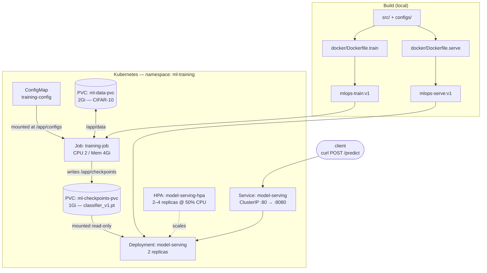

# mlops-pytorch-pipeline

A CIFAR-10 image classifier taken through the full deployment lifecycle: local
development, containerised training and serving with Docker, and orchestration
on Kubernetes using a Job for training and a Deployment for inference.

Training and serving are two separate workloads that never talk to each other.
They share exactly one thing — a PersistentVolumeClaim holding the model
checkpoint. The Job writes it; the Deployment mounts the same volume read-only
and serves predictions from it.

---

## Architecture



**Flow:** the Job reads hyperparameters from the ConfigMap, loads CIFAR-10 from
the data PVC, trains, and writes `classifier_v1.pt` to the checkpoint PVC. Once
it completes, the Deployment starts two replicas that mount that checkpoint
read-only and serve `/predict` behind a ClusterIP Service.

---

## Repository structure

```
mlops-pytorch-pipeline/
├── src/
│   ├── model.py                  # get_model(): simple_cnn | resnet18
│   ├── dataset.py                # CIFAR-10 transforms + DataLoaders
│   ├── train.py                  # training loop, JSON-lines logs, early stopping
│   └── serve.py                  # FastAPI: GET /health, POST /predict
├── configs/training_config.yaml  # hyperparameters (mirrors k8s/configmap.yaml)
├── docker/
│   ├── Dockerfile.train          # multi-stage training image
│   └── Dockerfile.serve          # multi-stage serving image, non-root
├── k8s/
│   ├── namespace.yaml            # namespace ml-training
│   ├── configmap.yaml            # training_config.yaml as a ConfigMap
│   ├── pvc.yaml                  # ml-data-pvc + ml-checkpoints-pvc
│   ├── training-job.yaml         # Job
│   ├── serving-deployment.yaml   # Deployment, 2 replicas, probes
│   ├── serving-service.yaml      # ClusterIP Service
│   └── hpa.yaml                  # HorizontalPodAutoscaler
├── requirements/
│   ├── train.txt                 # pinned, CPU-only wheels
│   └── serve.txt                 # inference deps only
├── tests/test_model.py
└── .github/workflows/ci.yml
```

`k8s/pvc.yaml` is not in the assignment's file list, but Part D requires
PersistentVolumeClaims and they have to be declared somewhere. They live in
their own file because a PVC must outlive the Job that writes to it.

---

## Prerequisites

- Python 3.11+
- Docker Desktop — **6 GB memory** (Settings → Resources). The training Job
  requests 4Gi and will stay `Pending` on a smaller node.
- `kubectl`, within one minor version of your cluster
- minikube (or kind / a cloud cluster)

---

## Configuration

`configs/training_config.yaml` is baked into the training image and is also
embedded in `k8s/configmap.yaml`. Keep the two in sync — the ConfigMap mount
shadows the copy inside the image.

| Key | Value | Meaning |
| --- | --- | --- |
| `model.architecture` | `simple_cnn` | `simple_cnn` (95K params) or `resnet18` (11.2M) |
| `model.num_classes` | `10` | CIFAR-10 classes |
| `training.epochs` | `10` | maximum epochs |
| `training.batch_size` | `64` | |
| `training.learning_rate` | `0.001` | Adam |
| `training.early_stopping_patience` | `3` | epochs without val-loss improvement |
| `data.data_dir` | `/app/data` | dataset mount |
| `output.checkpoint_dir` | `/app/checkpoints` | checkpoint mount |
| `output.model_name` | `classifier_v1.pt` | |

`simple_cnn` is the default because the target cluster is CPU-only, where
ResNet-18 takes hours per run. `get_model()` supports both.

### Environment variables

| Variable | Used by | Default |
| --- | --- | --- |
| `CONFIG_PATH` | `train.py` | `/app/configs/training_config.yaml` |
| `CHECKPOINT_PATH` | `serve.py` | `/app/checkpoints/classifier_v1.pt` |
| `MODEL_ARCH` | `serve.py` | `simple_cnn` |
| `NUM_CLASSES` | `serve.py` | `10` |

`MODEL_ARCH` must match the architecture that was trained. On a mismatch,
`serve.py` logs the error and reports `503` rather than crash-looping.

---

## Local development

```bash
python3 -m venv env && source env/bin/activate
pip install -r requirements/train.txt

# Paths in the config are container paths; override for a local run.
python src/train.py            # writes to /app/checkpoints unless CONFIG_PATH points elsewhere
```

---

## Docker

### Build

```bash
docker build -f docker/Dockerfile.train -t mlops-train:v1 .
docker build -f docker/Dockerfile.serve -t mlops-serve:v1 .
```

Both are multi-stage: a builder stage installs dependencies into `/install`,
and the runtime stage copies only that into a clean `python:3.11-slim`.
`requirements/*.txt` pin PyTorch's CPU index, which keeps the CUDA runtime out
of the image — roughly 1.35 GB instead of several GB.

### Train

```bash
mkdir -p data checkpoints
docker run --rm --shm-size=1g \
  -v "$(pwd)/data:/app/data" \
  -v "$(pwd)/checkpoints:/app/checkpoints" \
  mlops-train:v1
```

`--shm-size=1g` is required. The DataLoader uses two worker processes that pass
tensors through `/dev/shm`, and Docker's 64 MB default causes a bus error.

Expected output — one JSON object per epoch:

```json
{"epoch": 10, "train_loss": 0.8066, "train_accuracy": 0.7196, "val_loss": 0.8128, "val_accuracy": 0.7167}
{"event": "checkpoint_saved", "path": "/app/checkpoints/classifier_v1.pt"}
{"event": "training_complete", "best_val_loss": 0.8128}
```

### Serve

```bash
docker run --rm -p 8080:8080 \
  -v "$(pwd)/checkpoints:/app/checkpoints" \
  mlops-serve:v1

curl http://localhost:8080/health
curl -X POST http://localhost:8080/predict -F "image=@test_image.png"
```

The serving image runs as non-root (`appuser`, uid 10001), exposes 8080, and
declares a `HEALTHCHECK`; `docker ps` shows `(healthy)` once the model loads.

---

## Kubernetes

### Cluster setup

```bash
minikube start --driver=docker --memory=4500mb --cpus=4

# Enable addons after the API server is up — enabling them during start
# races the API server and silently fails.
minikube addons enable default-storageclass
minikube addons enable storage-provisioner
minikube addons enable metrics-server

kubectl get storageclass          # expect: standard (default)
```

Load the local images — they exist only in your Docker daemon, so without this
the cluster tries Docker Hub and fails with `ImagePullBackOff`:

```bash
minikube image load mlops-train:v1
minikube image load mlops-serve:v1
```

Re-run after every rebuild, and after any `minikube delete`.

### Deploy

```bash
kubectl apply -f k8s/namespace.yaml
kubectl apply -f k8s/configmap.yaml
kubectl apply -f k8s/pvc.yaml
kubectl apply -f k8s/training-job.yaml

kubectl logs -f job/training-job -n ml-training
kubectl wait --for=condition=complete job/training-job -n ml-training --timeout=45m
```

Then, once training has completed:

```bash
kubectl apply -f k8s/serving-deployment.yaml
kubectl apply -f k8s/serving-service.yaml
kubectl apply -f k8s/hpa.yaml

kubectl rollout status deployment/model-serving -n ml-training
```

Order matters. The serving pods mount the checkpoint the Job produces; started
early they stay unready (`503`) until it exists.

### Verify

```bash
kubectl get pods,svc,hpa -n ml-training
kubectl describe deployment model-serving -n ml-training
kubectl logs -n ml-training -l app=model-serving --tail=3
```

Expect two pods `1/1 Running` and `loaded checkpoint from /app/checkpoints/classifier_v1.pt`.

### Predict

```bash
kubectl port-forward svc/model-serving 8080:80 -n ml-training   # blocks

curl -X POST http://localhost:8080/predict -F "image=@test_image.png"
```

```json
{"predicted_class": "cat", "predicted_index": 3, "confidence": 0.7478,
 "probabilities": {"airplane": 0.0149, "...": "..."}}
```

### Optional: pre-seed the dataset

CIFAR-10 downloads from a host that frequently drops long transfers, and a
failed Job retries from zero. If you already have the archive locally, copy it
into the PVC first and the Job will verify its checksum and skip the download:

```bash
kubectl run seed -n ml-training --image=busybox --restart=Never \
  --overrides='{"spec":{"containers":[{"name":"seed","image":"busybox","command":["sleep","3600"],"volumeMounts":[{"name":"data","mountPath":"/app/data"}]}],"volumes":[{"name":"data","persistentVolumeClaim":{"claimName":"ml-data-pvc"}}]}}'

kubectl wait --for=condition=ready pod/seed -n ml-training --timeout=120s
kubectl cp data/cifar-10-python.tar.gz ml-training/seed:/app/data/cifar-10-python.tar.gz
kubectl delete pod seed -n ml-training
```

---

## API

| Method | Path | Request | Response |
| --- | --- | --- | --- |
| `GET` | `/health` | — | `200` with `{"status":"ok",...}` once loaded; `503` otherwise |
| `POST` | `/predict` | multipart form field `image` | `200` with class probabilities; `400` on an undecodable image; `503` if no model |

Uploads of any size are resized to 32×32 and normalised with the same
mean/std as the validation transform in `dataset.py`.

---

## Troubleshooting

| Symptom | Cause | Fix |
| --- | --- | --- |
| `DataLoader worker killed by signal: Bus error` | 64 MB `/dev/shm` | `--shm-size=1g`; in k8s a `medium: Memory` emptyDir at `/dev/shm` |
| `RuntimeError: File not found or corrupted.` | truncated CIFAR-10 download | `curl -C -` to the host, then pre-seed the PVC |
| `ImagePullBackOff` | image not in the cluster | `minikube image load …`, and `imagePullPolicy: IfNotPresent` |
| Pod stuck `Pending` | requests exceed node capacity | `kubectl describe pod …`; raise Docker memory or lower requests |
| PVC stuck `Pending` | no default StorageClass | `minikube addons enable default-storageclass storage-provisioner` |
| Serving pods `0/1` forever, logs show a state-dict error | `MODEL_ARCH` ≠ trained architecture | set `MODEL_ARCH` to match the ConfigMap |
| HPA shows `<unknown>/50%` | metrics-server missing or still sampling | `minikube addons enable metrics-server`; wait ~2 min |
| `unknown field "spec.backofflimit"` | YAML key casing | validate with `kubectl apply --dry-run=server` |

> **Warning:** `kubectl delete -f k8s/namespace.yaml` cascades to the PVCs, and
> minikube's default StorageClass reclaims volumes by deleting them — your
> trained checkpoint goes with it. To reset workloads only, delete the Job and
> Deployment.

---

## Git workflow

`main` is the release branch; `develop` integrates work. All changes land on
`feature/*` branches merged into `develop` via pull request, with Conventional
Commits messages.

```
main ──── develop ──┬── feature/repo-hygiene
                    ├── feature/pytorch-model
                    ├── feature/docker-containerization
                    ├── feature/k8s-deployment
                    └── feature/k8s-serving
```

---

## Results

| Metric | Value |
| --- | --- |
| Architecture | `simple_cnn`, 94,986 parameters |
| Epochs | 10 (no early stop) |
| Best validation loss | 0.8128 |
| Validation accuracy | 71.67% |
| Training duration (k8s Job, 2 CPU) | ~18 min |
| Image sizes | `mlops-train:v1` 1.35 GB, `mlops-serve:v1` 1.37 GB |
